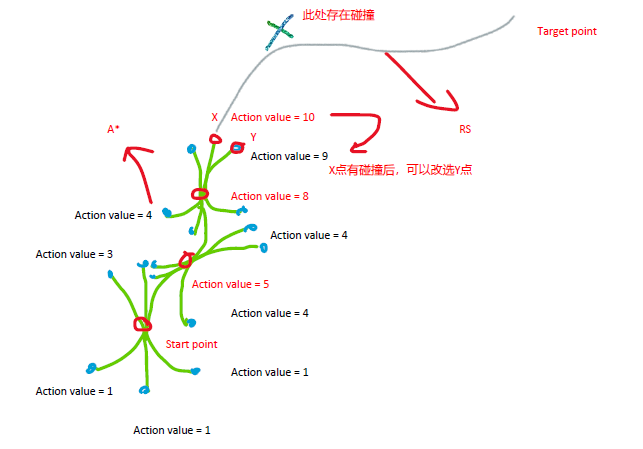
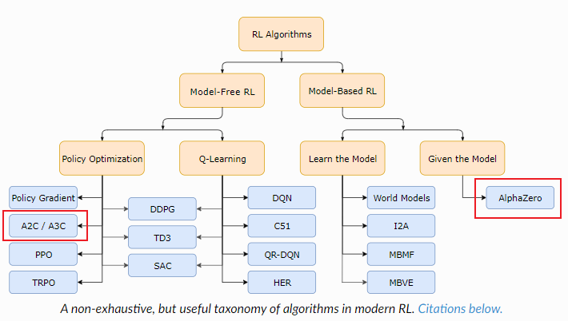
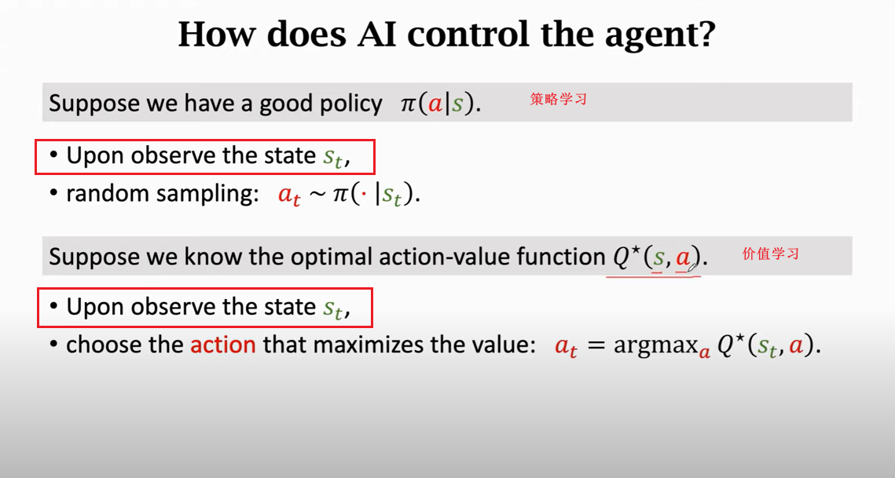
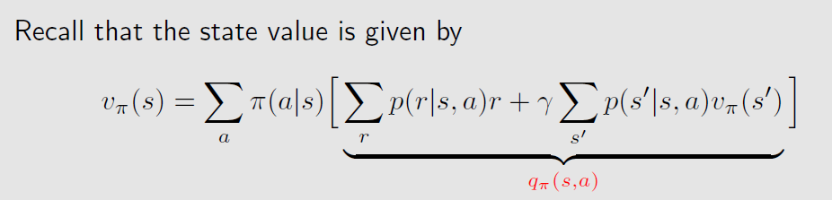
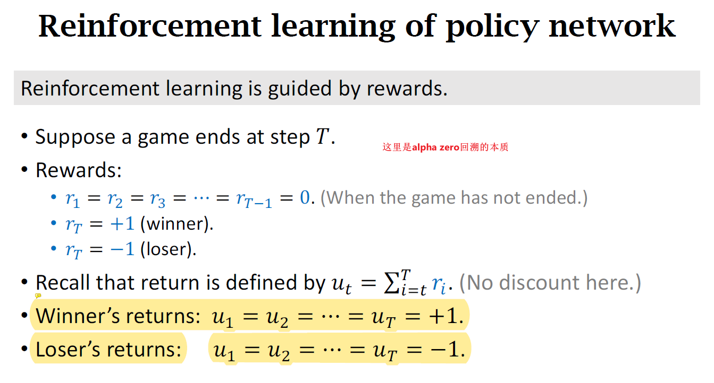
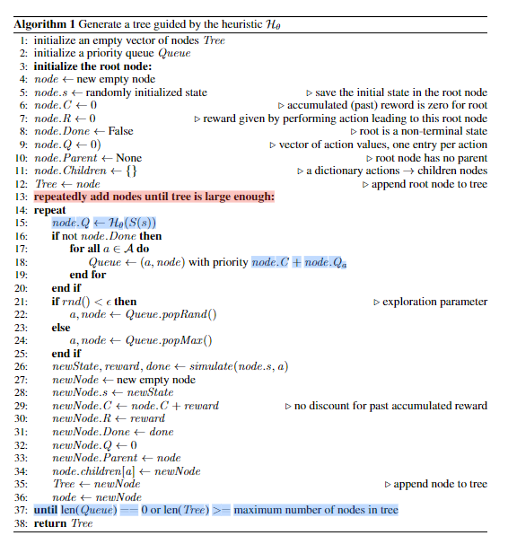

# Notebook

想要解决的问题：是DRL对hybrid A star的搜索进行加速，即DRL直接根据当前state给出optimal action（而非人工定义的启发函数），得到next state，然后再给optimal action，。。。直到得到轨迹【记作DHAS】

=====================================

### 方案1：DQN
1. 输入为128维（15个障碍物 * 4个角点 *2个坐标x/y）+ 起点坐标（x, y, yaw） + 终点坐标（x, y, yaw）+ 补了两个0凑成128
2. 输出为6个动作（右前，中前，左前，右后，中后，左后）
3. 网络为5层Resnet
4. 给了碰撞、episode耗时、原地打转的惩罚，和发现路径的奖励等

**遇到的问题：DRL倾向于直接撞障碍物或者原地打转**

=====================================

### 方案2：DQN + cut action space

方案1中人为设计的奖惩，难以在撞障碍物和原地打转之间平衡，引入如下方案2：
1. 撞障碍物：变相的裁剪到action space：在给出optimal action之前要先做overlap校验，有碰撞的动作不可选。该方案可以避免DRL的老是向障碍物上撞
2. 原地打转：借用hybrid A star上grid的概念，将已经探索到的grid（这个grid map是3维的：x, y, yaw）设置为不可选（有点像围棋上已经下子的点不能被再下子，实际上也是对action space的裁剪）

上述方案里的第1点已经实施，**让DRL尽量跑满episode充分探索。但发现训练10000次发现该方案基本没有任何提高和降低**。因此提出方案3：

=====================================

### 方案3：AlphaGo（MCTS + DNN）

1. 针对方案2撞障碍物，修改action space后不奏效的问题，应该是因为初始参数下完全通过试错学习，效率极其低下：该场景类似围棋，episode结束前的reward指导意义较小（reward很重要，TD中代表具有实际意义的TD target，用于指导DNN的反向传播），只有最后时刻且PathFnd下的reward对action value net的反向传播有好的指导作用。DRL会先把episode_tn-1时刻的Q训练好，然后再逐渐训练好episode_tn-2时刻的Q，以此类推直至episode_t1，，而训练初期（此时Q不好，无法倾向探索好的node）基本完全在试错，因此在拓展层数较深或者action space较大的场景中效率极慢。针对这个问题应该借鉴AlphaGo而非AlphaZero的方案：在前期使用IM学习人类棋谱以得到一个较好的policy net，然后再用RL提升这个policy net。用在本case下就是充分拓展MCTS，并通过leaf node的reward回溯搜索树中每个node的state value和action value，用于action value net的监督学习

2. 针对方案2原地打转想来想去不建议引入HAS的occupied grid，而是用MCTS：在MCTS拓展过程中不允许向parent拓展，以便更充分的探索而不受grid cell size的制约

3. AlphaZero是model-based的DRL方法，其重点在MCTS，DNN仅用于2处：一是对MCTS进行宽度和深度上的裁剪，二是用于逼近和存储MCTS信息。
   
4. AlphaZero为何同时拥有policy net和value net？实际可以用value net做policy net的活儿（即给出先验概率进行MCTS的宽度裁剪），但一是在巨大action space的情况下效率低下；二是他俩本质是在干两个不同的事情，用不同的网络头会更适合，并在一起实践效果不好。详见AlphaZero作者本人的解释：https://www.reddit.com/r/reinforcementlearning/comments/1b1te73/help_me_understand_why_use_a_policy_net_instead/

5. AlphaZero存储**每次对弈下的softmax(n_visit)** 和 **每局结束并backpropagate后的winflag**用于policy net和value net的训练
   
6. 实际对弈过程中有3种指导拓展node的方式：
   1. 用policy net指导: 该方案是选择当前state下的optimal action的，属于先验因此算的快，很适用于实时规划；但不同state之间的action不具备比较意义，因此开弓没有回头箭，这要求policy net训练的非常好并且可以较好应对奇异值才行
   2. 用value net指导：需要从当前state执行action并得到next_state后，才能通过value net得到state value，然后**在整个tree中的leaf nodes中通过max value对应的action【propagate是对整个tree回溯，使value不受state限制，因此不同state下的value可以相互比较】**。如AlphaZero作者解释，这样计算量也较大。但**优势是发现当前state下的optical action不够好时可以“反悔”到其他state**，这一点可用在DHAS的heuristic func上
   3. 在线滚动计算MCTS，用在线的n_visits指导：AlphaZero的方案，原因是可以避免DNN的奇异值，但在线滚动1600次MCTS计算量巨大
   4. DHAS可用policy net进行动作空间裁剪，再加value net给出state value做heuristic func。平衡计算速度和兜底

7. 从DRL的角度思考AlphaZero，MCTS是解决了DRL中最难解决的reward问题，即稀疏/延时奖励下如何准确及时的给出reward。除了MCTS也可以使用IM解决reward的问题

8. 存储MCTS生成轨迹成功场景链路的每一步（失败分支没有学习意义），用于模仿训练，让DNN的参数尽可能逼近MCTS给出的状态价值和动作概率
   
9.  但是AlphaZero的方案在每次take action时，都要基于当前state用MCTS滚动1600次，以得到n_visits用于policy net的训练，且滚动1600次均没有记录state value。个人感觉该方案用于DHAS浪费严重，因为AlphaZero重点更像是在MCTS，而DHAS重点在state value，照搬AlphaZero方案对DHAS来讲不够有针对性。因此给出方案4
   
=====================================

### 方案4：A2C + MCTS

1. 用MCTS充分探索(episode end)，并通过leaf node的reward回溯搜索树中每个node的V和Q（AlphaZero中每次expand node都会用DNN给出的state value回溯，一局结束后用Game给出的state value回溯），用于action value net的训练。有了好的Q，则可以通过A2C训练出好的policy net。最终上HAS实际要使用state value(原因详见第3条)，因此也需要借助action value net训练出state value net。policy net用于DHAS的action space裁剪，state value net用于DHAS的node评估

2. 另外此处要引入解释下：A2C里也存在policy net和value net，其value net一般指的是action value（不是state value，也不是reward）。那么A2C和AlphaZero如此相像，为什么AlphaZero在围棋表现优秀而A2C却做不到？原因是：AlphaZero 将基于模型的规划（MCTS）和高效探索相结合，可以提前计划、探索潜在的走法。A2C是无模型的，仅依赖于试错探索，在围棋这种复杂环境中可能效率较低，但A2C对于更简单的任务和连续的行动空间仍然很有价值。另外A2C的两个net是同时训练的，而AlphaZero实现训练policy net在训练value net

3. 首先要再强调的是DQN是在某个state下通过action value给出optimal action，它并不能在不同state下比较action的优劣。但发现《Reinforcement Learning with A* and a Deep Heuristic》中假设了在不同state下比较action value不失一般性，感觉不太有理论支撑，原因见下图，对于policy（策略学习）和action value（价值学习）而言，都是基于某个状态S。但HAS在推演过程中实在全局选optimal node

   
4. 回溯的时候要注意bellman equation：**return_parent = Sum_pi(return_child * gamma + reward)**

AlphaZero回溯的本质：

5. 从leaf node向root回溯时，为了遵循MDP假设，可以将当前steer和gear可以放在state里，根据action给出对steer和gear的reward。

6. 在expand node时不需要像AlphaZero那样rollout达1600次，DHAS不需要像下围棋那样推演，没这么高的要求，可以根据PUCT得来的
   
7. 在tree拓展完成并对所有leaf node进行propagate后，所有experience(state, state/action_value)都被存储到buffer里用于DNN训练

8. 需要训练2个网络：policy net和value net，因为动作空间大不想每次通过state value做select action，因此需要policy net先做裁剪在用value net给出state value。policy net用action value训练

https://github.com/FQF0901/aleph_star/tree/master

9. value net是对MCTS的逼近和存储（并用于MCTS的裁剪和引导），那么DNN对启发函数的优化上限是MCTS找到轨迹的性能线附近（如果MCTS在某些case下找不到轨迹，那DNN就没有该case下可逼近的有价值的Q），而MCTS的性能应该是高于HAS的（因为MCTS有好的DNN指导并具有随机性并且有A2C迭代，有机会探索到更好的拓展方案）。**那么为何某些场景下人可以找到泊车轨迹而MCTS/HAS找不到**？但仍旧该问题给出方案5
   
=====================================

### 方案5：
 
某些case下人可以找到轨迹，但MCTS/HAS找不到轨迹的根本原因有两个：
- cycle counter > max_search_cnt
- openlist = []
  
其他如spacelimit等全是人为附加的场景，和规划本身无关

1. cycle counter > max_search_cnt问题本质有两个：
   1. 一是max_search_cnt不能放太大因为会有计算力和实时性问题，【增加硬件算力，改善启发函数】
   2. 二是启发函数不够好，没法在很短的时间内给出有用的node，而只能暴力搜索【改善启发函数】
   
2. openlist = []分两种：
   1. 一是确实空间逼仄，动作又是离散的，无法充分利用空间导致给不出轨迹。【动力由离散 -> 连续】
   2. 二是有些case默认算法下规划会open list =[]，但修改heuristic func后却能出轨迹。原因是grid尺寸大，且启发函数不好，导致non-optimal node先占领了某些grid，使得后续拓展出来的optimal node无法占领该grid，而RS又是解析解导致给不出无碰撞轨迹。【改善启发函数，缩小grid尺寸(其极限是动作连续)】

可以看出上述两个问题有3个方案：
1. 增加硬件算力：难以实现
2. 改善启发函数：MCTS + DNN已经解决
3. **改为连续动作空间：方案4需要解决的问题**

因此引入DDPG
