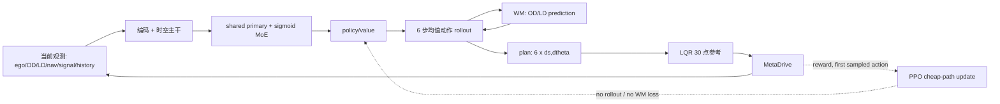

# db44fefe 城市/高速端到端驾驶系统静态攻防审查

审查对象：`db44fefe3d0f7fcdadfd970bcb60187d3fdc0544`（审查时该提交等于 `HEAD`，受跟踪文件无工作区偏差）。目标是城市/高速端到端驾驶：BCE 场景标签监督的 MoE、IL+RL、可输出轨迹的内部 LD/OD world-model rollout，并由下游 LQR/MPC 跟踪。

审查方法：沿 `observation → encoder/temporal/MoE → policy/WM rollout → tracker/env → buffer/loss → eval gate` 静态追踪数据、物理时刻、坐标系、执行语义和梯度；交叉检查配置、测试及已有实验记录。本文把直接代码事实与设计推断分开，严重度定义如下：

- **P0 / 阻断**：会让训练目标、执行闭环或放行结论失真，当前不能用于安全相关结论。
- **P1 / 高风险**：不一定立即报错，但会系统性削弱泛化、专家化或轨迹质量。
- **P2 / 工程债**：可观测性、测试或接口不足，会妨碍定位和迭代。

本审查未执行长时训练、MetaDrive 大样本复评或实车试验。因此，它能证明代码中存在的契约缺口，不能证明修复后的性能或安全性。

## 结论

**结论：架构方向合理，当前实现适合作为研究原型和仿真闭环基线，但不具备城市/高速实车策略网络的放行条件；现有 release gate 本身也不足以给出可信放行结论。**

正向部分很明确：动作 `(ds, dtheta)`、6 步轨迹、30 点 LQR 参考的几何约定是一致的；A/B/C 的大方向也合理，Stage A 已处理未来 OD 槽位重排，Stage B 把即时动作作为主监督并把轨迹作为小权重辅助。这些是很扎实的地基。

放行被以下问题阻断：Stage C 的 world model 和后五步策略输出会影响 LQR 当前执行，却没有对应的 PPO likelihood 或 WM 更新；在线 router 标签与被监督观测错一个策略步，且本地池终局混入 reset 后状态；内部 imagined rollout 没有更新导航 token；评测允许 checkpoint 部分随机初始化并比较不等价的 tracker 语义；MoE 的 BCE 只监督 gate 标签，不保证专家分工。它们会直接削弱“用场景监督避免拆东墙补西墙”和“内部 rollout 产出可部署轨迹”两个目标，也会让 KPI 看起来比实际更可信。

## 设计事实图

这里的实线是实际执行依赖；虚线表示现有 PPO 的可微/优化路径。核心缺口是 `W` 和后五步 policy mean 都在 LQR 的**当前 0.5 s 控制依赖图**中，却不在 PPO 的 action likelihood 中；`W` 也不在 Stage C 的优化图和验收图中。

## 风险总表

| 目标 | 当前实现 | 判定 |
| --- | --- | --- |
| MoE + BCE 缓解场景间负迁移 | 多标签 router BCE 已接线，primary 常开、specific 残差零初始化；没有专家隔离、负载/多样性约束或反事实消融 | **方向合理，证据不足** |
| IL + RL | Stage B BC 后接 Stage C PPO，并有冻结 BC 快照 KL；但 local/vector pool 的有效 action 定义不同，默认 KL 最终降为 0 | **RL 目标未闭合** |
| WM 推演 LD + OD 供 rollout | 6×0.5 s 内部 rollout 和 30×0.1 s LQR 参考已实现；nav 不随 imagined ego 更新，WM 无不确定性/对象生灭 | **研究原型可用，部署语义不完整** |
| 分阶段训练 | A→B→C 的因果顺序正确，B 冻结 WM 合理；C 实际未冻结共享主干，解冻 WM 又无损失且 LR 无隔离 | **A/B 基本合理，C 不成立** |
| 监督设计 | action、trajectory、router、WM 目标均存在；在线 router 错位、BC anchor 错配、WM gate 过弱 | **存在目标污染** |
| WM/rollout/env 配合 | 坐标与 6→30 点几何基本一致；执行反馈、风险约束和梯度 credit 不闭合 | **不满足实车 contract** |
| KPI/release gate | 有分组/Wilson/KPI 框架；默认 exact 与规则基线执行语义不同，部分 ckpt 可继续评测 | **当前 verdict 不可作放行依据** |

## Findings

### P0-1: Stage C 的有效环境动作是整条 plan，PPO 却只对首动作记账；WM 解冻也没有训练信号

`pipeline/trainer.py::PPOTrainer.collect_rollout()` 调用 `model(..., rollout=True, world_model=False)`，把 `plan[:, 0]` 替换为采样动作后，将完整 6 步 plan 交给 `LqrTracker`。LQR 带预瞄，当前 0.5 s 的 steer/throttle 已依赖整条 3 s reference；因此环境的有效 action 不是单独的 `a_t`，而是“采样首动作 + 五个确定性 policy mean + WM imagined states”。buffer 却只保存首动作及其 log-prob。

随后 `PPOTrainer.update()` 明确调用 `model(..., rollout=False, world_model=False)`；PPO/价值/router/KL/BC anchor 都不消费 `traj_xy`、`plan`、`od_pred` 或 `ld_pred`。`pipeline/stages.py::run_stage_c()` 在约四分之一 update 后只是将 WM 参数重新加入 optimizer，没有对应损失，因此 WM 参数不会获得梯度。

执行语义还随 pool 改变：默认 `--pool local` 使用上述 LQR 整条 plan；`--pool auto/vector` 且多环境时进入 `VectorPoolAdapter`，它明确忽略 `references`，把 tracker 请求降级为 kinematic 并只展开首动作。同一 Stage C 因并行参数不同而对应两个不同 MDP，训练结果不可直接合并解释。

影响：PPO ratio 对不上真正影响 reward 的控制变量，后五步策略输出与 WM 误差可改变当前控制却没有正确 credit assignment；所谓“WM 解冻”只是 optimizer 记账。即使训练曲线稳定，也不能据此声称 RL 优化了 WM planner。

证据：`pipeline/trainer.py::collect_rollout`、`pipeline/trainer.py::update`、`pipeline/stages.py::run_stage_c`、`net/model.py::_rollout_traj`。

修复：在 Stage C 二选一，不能保持当前中间态。

1. **建立干净的 PPO 基线**：让 tracker 在当前控制周期只依赖被 PPO 记账的 action，WM 只做离线辅助；这是最容易判断 RL 是否有效的基线。
2. **把 plan 定义为正式 action**：为整条低维 plan 定义联合分布/log-prob，或使用可微 planner objective；同时加入同分布 replay/online future 的 WM 多步损失、轨迹 consistency 和不确定性惩罚。不能继续用“首动作 PPO + 整条 plan 执行”的中间态。

验收：增加测试断言“WM 解冻后的 Stage C 一个 update，WM 参数发生非零且有限的更新”；验证参与 LQR 当前控制的每个随机变量都存在匹配的 likelihood/目标；记录预测与真实未来的按 horizon/标签分组 ADE、FDE、速度误差、车道几何误差，以及 closed-loop 与 oracle/reference-only 的差值。

### P0-2: PPO router BCE 将动作后的标签配给动作前的观测

PPO 收集循环以 `obs_current`（动作前）入 buffer，却从 `pool.step()` 返回的 record/info 读取 `router_labels`（动作后）。于是训练的是 $p(y_{t+1}|o_t)$，而网络部署时输出应是 $p(y_t|o_t)$。`VectorPoolAdapter` 会保留终局 record 再 reset，因此主要是一步错位；`LocalEnvPool.step()` 则先 reset 再 `_record()`，使终局的 `obs/pose/router_labels` 来自新 episode，而 `info/done` 来自旧 episode，污染更重。

影响：路由器得到半秒未来泄漏/错位监督；在 cut-in、merge、near-intersection 边界尤其明显。该缺口会使 BCE 看起来可下降，但路由触发时序不能用于保护场景泛化。

证据：`pipeline/trainer.py::collect_rollout`、`pipeline/trainer.py::LocalEnvPool.step`、`pipeline/trainer.py::LocalEnvPool._record`。

修复：在执行动作前，对当前 `obs_current` 同步计算并保存标签；或者将 post-step label 与 post-step obs 一同写入下一条 transition。终局 record 必须保存 terminal-state observation/label，再单独 reset，不能把 reset observation 伪装成 terminal transition。

验收：构造标签在一步内翻转的环境 stub，断言 buffer 中的 `(obs, label)` 来自同一物理时刻；记录标签正例率、按标签 precision/recall/F1、ECE 和 lead/lag 分布。

### P0-3: imagined rollout 没有更新 nav，导致 3 秒轨迹在路口/匝道使用过期导航

`DrivingModel._rollout_traj()` 每步会重建 ego、OD、LD，并重编码这些输入；但它持续传入初始的 `nav_token` 和 `signal_token`。`nav` 含两个自车系 checkpoint、转向命令和 route completion，随着 ego 沿 rollout 前进必须重新表达。当前做法相当于车辆在未来每个 0.5 秒都看到 t0 的 checkpoint。

影响：直道上可能不显著，但在匝道、并线、路口、环岛和导航 checkpoint 切换处，后续五步动作没有正确任务条件。这会使“轨迹给 MPC/LQR”在最需要前瞻的场景失去语义正确性。

证据：`net/model.py::_rollout_traj`；`env/obs/nav.py::NavChannel.build`。

修复：将世界系 route/polyline、route progress、下一分叉语义纳入可 rollout 的地图状态；每一步根据新 ego pose 重建 nav features/token。当前 `signal` 是恒定 unknown，占位本身不是问题，但接入红绿灯后也必须使用时间推进的状态预测。

验收：设计一个 3 秒内经过 checkpoint/转向点的样例，比较逐步重算 nav 与当前复用 nav 的 plan，要求前者被实际使用；对 route-command 切换单测加入模型 rollout。

### P0-4: `--bc-anchor` 在 RL 状态和随机 BC 状态之间错误配对

当启用 `--bc-anchor` 时，代码在当前 PPO observation 上得到 `mu`，却与随机抽取的 BC action 直接做 L1。这不是 $\mathcal{L}_{BC}(\pi(o_E), a_E)$，而是把任何 RL 状态向专家动作的边际分布拉拽。默认 PPO minibatch 是 1024，代码最多抽 64 个 expert action；两者在 batch 维不可广播，默认配置下还会直接触发 shape error。

影响：该可选项默认关闭时不影响主路径；一旦启用，要么报错，要么在小 batch 下产生无条件动作偏置，不能作为抗遗忘锚。

证据：`pipeline/trainer.py::PPOTrainer.update`。

修复：抽样 BC index 后必须构造对应 BC observation，并单独前向 `model(bc_obs)` 再比较 expert action；更推荐保留基于同一 RL observation 的 Stage-B reference policy KL，并按 OOD/安全场景调度系数。

### P0-5: 当前评测 verdict 不能作为放行证据

这是验收系统问题，不是网络前向问题，但会直接改变“架构是否有效”的结论：

- `pipeline/eval_runner.py::_load_ckpt_model()` 会过滤 missing/shape-mismatch 权重，再以 `strict=False` 保留随机初始化参数并继续生成指标。正式 gate 可能评到一个部分加载模型。
- ckpt 默认 `tracker=exact`，由 `ExactTracker` 在 `env.step()` 后直接写 ego 位姿；规则 baseline 使用 `PurePursuitIDMPolicy` 的动力学闭环。二者共享 KPI 阈值但执行语义不等价。
- exact 路径在 `env.step()` 返回 `info` 后才改 ego 位姿；随后速度优先读旧 `info["velocity"]`，航向却读改写后的 ego，导致纵/横向加速度等 KPI 混合两个状态时刻。
- `mean_speed_mps` 实际只对最终一步的单个 `info["velocity"]` 求均值，并非 episode mean。
- `a_lat_mean <= baseline * 1.10` 对带符号均值不成立：负 baseline 会让更接近 0 的候选反而失败；应比较绝对均值或分位数。
- `config/eval.yaml::dataset_gate` 是声明性配置，未进入 `evaluate_verdicts()` 的 `all_passed`。

修复：正式评测必须严格加载 checkpoint；baseline 与 candidate 使用相同动力学保真度和采样时刻；post-step 后重建同一时刻 KPI；修正 episode mean，移除带符号均值门槛；把 dataset gate 变成可执行且失败即非零退出的前置条件。研究时可保留 exact 作为“纯规划轨迹”诊断，但不得与闭环 baseline 合并为一个 release verdict。

### P0-6: Stage C 的真实冻结范围与设计声明不一致

Stage C 会重新 `build_model()` 并加载 state dict；checkpoint 不保存 `requires_grad`。随后代码只调用 `apply_freeze_prefixes(model, ("world_model.",))`。因此在 critic warmup 之外，encoder、temporal、spatial、latent、router、specific、policy、value **全部可训练**；primary 也可训练，只是 `build_optimizer()` 按参数名给它 0.1× LR。README 中“冻结 encoder/temporal/spatial/primary”的描述并未实现。

影响：PPO 的高方差梯度会以完整 LR 改写 Stage A/B 的共享表示，正是最容易产生“修复某场景、破坏另一场景”的路径；同时 KL 只约束 action distribution，不约束 latent、router 或 WM 表征。当前 300-update 结果不能被解释为设计表中的那套冻结策略。

修复：用显式 allowlist 定义每阶段可训练参数并在启动时打印/断言参数名、数量、LR；Stage C 基线先只训练 `value + policy + specific`，共享 backbone/primary/router/WM 冻结。若逐步解冻，按模块建立独立 optimizer group 和 gate-based rollback，而不是空前缀一次性 `requires_grad_(True)`。

验收：加载 Stage-B checkpoint 后，在每个 Stage-C 子阶段断言 trainable parameter name 集合与规范逐项相等；一个 update 后比较参数 hash，冻结集合必须逐位不变。

## High Findings

### H-1: MoE 是可解释的多标签 gate，不是有保证的专家化

primary 恒激活、specific experts 零初始化、sigmoid+BCE 的组合稳定且利于不破坏基础能力。不过 8 个 sigmoid gate 可同时全开；没有 top-k、负载均衡/去相关损失、专家输出多样性损失或 per-expert outcome 约束。`RouterMonitor` 只观测负载，不把问题变成优化目标。多标签共现时，primary 可能承担全部任务，specific experts 也可能共同复制同一残差。

Stage A 让 MoE 随 WM loss 一起训练，却没有 router BCE；Stage B primary phase 训练 shared/primary/router/policy，specific phase 冻结 shared/primary 但同时训练 experts/router/policy/residual scale。由于 gate 和 policy head 都在动，且没有固定 gate 或反事实消融，难以判断性能来自 expert、router 还是 policy head。标签本身是场景状态而非 maneuver/风险后果，不能自动实现“哪里坏修哪里”。

建议：保留 sigmoid 多标签语义，但增设 `(1)` 类别失衡的 pos_weight/focal 或采样策略，`(2)` expert residual orthogonality/variance 或 conditional sparsity 正则，`(3)` 每个标签条件下的 per-expert counterfactual ablation，`(4)` router 校准和切换迟滞指标。不要贸然改成 softmax，因为这些标签天然可共现。

### H-2: OD identity 在历史输入和未来监督两端都不稳

`ODChannel` 每帧按 TTC+距离重新排序；`FrameMemory.stack()` 只做 SE(2) 坐标变换，不做对象关联；`TemporalEncoder` 却按固定 slot index 用 GRU 跨帧累积。因此相邻帧一旦换序，同一个 hidden slot 会混入不同车辆。Stage A 虽对未来 target 做最近邻重排，但每个当前 slot 独立 `argmin`，不是一对一分配，两个当前对象可复制同一未来对象；新出现对象则没有当前 slot 可承接。

影响：历史编码与 WM 监督都可能把“槽位”误当“对象”，cut-in、密集跟车和交叉口正是换序最频繁的场景。这会同时污染 router、policy 和 WM，不只是 ADE 指标噪声。

建议：数据层优先保留稳定 track id；否则使用带占用约束的 Hungarian/greedy one-to-one association，并显式建模 existence/visibility。增加“仅交换输入 slot 不改变场景输出”的 permutation/identity 测试和“两对象竞争一目标”的匹配测试。

### H-3: world model 对动态交通的表达能力和安全边界不足

WM 对每个 OD slot 预测单一确定性状态，OD/LD 都从 t0 固定状态直接解码；无对象 birth/death/visibility、无不确定性、多模态或 occupancy 表达。城市 cut-in、遮挡、交叉口来车恰好是多模态和出现/消失最强的区域。

建议：短期至少加入 one-to-one assignment 或稳定 track id、existence/visibility head、预测方差或 ensemble；中期将 LD map 表达改为可查询局部 lane graph，并把碰撞距离、TTC、可行驶区域和 route consistency 变成 planner cost。若不提供风险边界，WM 只能作为表征辅助，不能成为安全相关 reference 的唯一来源。

### H-4: IL 与真实执行器存在 dynamics gap，且当前只有 LQR 没有 MPC

Stage B 主要拟合专家即时 `(ds,dtheta)` 和 imagined trajectory；Stage C 执行时通过 `LqrTracker` 跟踪 3 秒参考。LQR 不消费 OD/LD 预测，也不做碰撞/可行驶区域优化；配置写 `mpc_lqr`，实现实际固定为 `tracker="lqr"`。此外，专家数据若由 ExactTracker 或其它专家采集，BC 学到的是理想圆弧而非 LQR 后的真实闭环轨迹。

建议：明确两个产品形态：

- **LQR 版本**：网络输出需经 tracking-error domain randomization 训练，在线记录 reference-vs-realized 横向/航向/速度误差，并由独立安全 shield 限制风险。
- **MPC 版本**：将网络输出的 route、OD occupancy/uncertainty、lane constraints 和代价交给 MPC；MPC 的实际首控制量和可行性/降级状态应回流到训练数据。

在两种形态下，都应用执行器后的真实状态产生 reward、标签与训练轨迹，不能用 ideal tracker 成绩替代。

### H-5: Stage A 的损失和训练分布不够支撑部署用途

直接多步 Huber + 角度损失是良好起点，但位置（m）、速度（m/s）、曲率（1/m）和角度直接同权相加，缺少归一化和任务权重。训练 teacher-forcing 使用专家 plan，加的是独立元素噪声；推理使用本策略自回归均值计划，存在明显 exposure bias。Stage A 只报告相对匀速基线的 OD ADE/FDE，未单列 LD，也没有按 horizon、场景标签、速度和新出现对象分层。

建议：分量尺度化；同时训练 expert/policy/mixed plan 条件；做 scheduled sampling；将 WM early stop/放行绑定到按标签的 FDE、lane error、TTC/collision recall、NLL/calibration，而不是只要求优于匀速。

### H-6: 奖励和终局语义存在安全漏项

`reward_model.terms.CRASH_FLAGS` 不含 `crash_human`，而 trainer/eval 的碰撞集合包含它；因此人员碰撞可能在 KPI 中算 collision，却不触发正式 `CrashPenalty`/CaRL crash。`reward_model.aggregation._terminal_key()` 和 eval termination 都先判断 `arrive_dest` 再判断 collision，同一步同时到达和碰撞时会标成 arrival。

建议：碰撞键建立单一共享常量；安全终局采用 collision/out-of-road 优先，成功必须定义为 `arrive_dest and not collision and not off_road`。用组合真值表覆盖每一种 MetaDrive crash flag 及“到达+碰撞”并发事件。

### H-7: 场景覆盖尚不能代表城市/高速 ODD

当前生成器主要覆盖小规模 BIG block、脚本 cut-in/cut-out、跟车/拥挤/曲线/汇入/环岛/路口邻近；`traffic_lights=false`，signal 是占位。尚未形成高速主辅路速度差、长匝道/织入区、施工/静态障碍、天气与附着、传感器退化、紧急车辆、复杂信号相位等 ODD 覆盖。

这不是“再加几个标签”即可解决：应先冻结目标 ODD 与 scenario coverage matrix，再决定哪些变量用于 router，哪些用于连续 risk head，哪些只进入分组 KPI。否则 MoE 容量会被 taxonomy 偶然性绑定。

## Supervision Review

### 场景标签 BCE

标签顺序在配置、模型、数据集间固定，工程契约清楚；推理时只使用 router prediction，不直接喂标签，这一点是对的。但“全部逐步可观测”的配置描述不准确：`cutin_active/cutout_active` 使用脚本 `event_state`，地图类标签使用完整 map geometry，它们是可用于训练的 privileged labels，不一定能从当前有限观测唯一恢复。主要缺口是在线错位（P0-2）、可辨识性、类别不平衡、阈值硬切换和缺少校准指标。

建议建立三层监督：

1. router BCE：当前可观测的可复核状态；只用于 gate 可解释性。
2. auxiliary risk heads：TTC、cut-in probability、lane availability、route feasibility、tracking feasibility；允许连续标签和时域预测。
3. outcome/KPI：按标签和组合标签报告 collision、route success、jerk、tracking error；以最弱组下界约束 RL，而不是只优化总体回报。

### 行为与轨迹监督

即时 action 作为 BC 主项是正确的；6 点轨迹与 30 点目标的时间对齐也正确。轨迹辅助在 YAML 默认是 0.1、当前实验依赖 CLI 覆盖为 0.3；WM 冻结并 detach，避免 BC 为了轨迹损失破坏 Stage A 的动态模型，这个因果隔离是合理的，但默认配置与已声明配方不一致，正式复现实验前应统一。

但是轨迹监督只拟合 ego geometric path，未显式惩罚与 OD/LD 预测的碰撞、越界、逆行、舒适性和 tracking feasibility。应在 BC 阶段加入可微或离线计算的 trajectory feasibility labels，并对高风险片段提高权重；否则 BCE-MoE 和轨迹头都可能在平均意义正确、在关键风险片段错误。

## 推荐训练编排

先区分“当前代码实际行为”和“建议行为”。当前 `--lr` 默认统一为 `3e-4`：

| 当前阶段 | 实际 trainable | 实际 frozen | 主要问题 |
| --- | --- | --- | --- |
| A | encoders、temporal、spatial、latent、primary、router、8 experts、WM | policy、value | MoE/router 只受 WM loss，无 BCE；全部单 LR |
| B-primary | shared backbone、primary、router、policy、residual scale | WM、value、specific experts | 基本合理，但 router 与 policy 同时变化 |
| B-specific | specific experts、router、policy、residual scale | WM、value、shared backbone、primary | 无法把收益唯一归因于 expert |
| C-warmup | value head | 其余参数临时冻结 | value 只能拟合冻结 latent，当前 explained variance 仍接近 0 |
| C-PPO 前段 | 除 WM 外全部模块 | WM | 与 README 声称的“冻结 shared/primary”不符 |
| C-PPO 后段 | 全模型 | 无 | WM 无 loss；shared 全 LR，primary 0.1×，KL 默认衰减到 0 |

下面的 LR 是首轮搜索起点，不是已验证最优值。更重要的约束是每阶段显式 allowlist、模块级梯度范数、冻结参数 hash 和最弱场景 KPI。

### 阶段 0: 数据与契约门槛

- 按 episode、route/map、traffic seed、事件模板做 group split，避免相邻帧、同一路图泄漏到验证集。
- 保存每帧 `obs_t`、标签 `y_t`、实际执行 action、LQR/MPC realized trajectory、future OD/LD track identity/visibility、expert/reference plan。
- 先固定动作与参考坐标约定，再验证 net rollout、tracker interpolation、真实闭环三者的 30 点误差。

### 阶段 A: representation + WM

先训练通用 dynamics，而不是让尚无标签监督的 specific experts 共同吸收 WM loss：建议 A0 只开放 encoder/temporal/spatial/latent/primary/WM，冻结 router/specific/policy/value；A1 再冻结 dynamics 主体，用时间对齐且带类别权重的 BCE 单独预热 router。可从 backbone/primary $1\times10^{-4}$、WM $1$–$3\times10^{-4}$、router $3\times10^{-4}$ 起步，采用 AdamW、warmup/cosine，并由 validation early stop 而不是固定 10 epochs 决定结束。

训练顺序应从短 horizon、直道/车少覆盖扩展到 3 秒、匝道/密集/事件场景；但验证必须保留全场景和跨地图集。先修复历史 OD identity 和 future one-to-one association，再谈 WM 指标；只有满足分组 WM 门槛后，才允许进入 Stage B 的 imagined rollout。

### 阶段 B: policy BC + constrained specialization

1. 加载通过 Stage A 门槛的 checkpoint；WM 参数冻结且 rollout detach。
2. primary phase：specific gates 固定为 0，训练 shared/primary/policy；router 只吃 BCE，不让行为 loss 反向塑造标签语义。policy 可从 $3\times10^{-4}$、shared/primary 从 $3\times10^{-5}$–$1\times10^{-4}$ 起步。
3. specific attribution phase：冻结 shared/primary/policy/router，用 ground-truth multi-hot gate 训练对应 expert residual，expert LR 可从 $1$–$3\times10^{-4}$ 起步。这样才能检验 expert 是否在固定策略映射下接管条件残差。
4. routing calibration phase：切回 predicted gate，仅以较小 LR 联合微调 experts/router/policy（约上一阶段 0.1×），并以最弱场景 KPI、router ECE 和 primary-only 回归早停。

每阶段都要做 `primary only`、`all gates zero`、`single expert ablation`、`shuffled labels` 对照；没有这些对照，不能声称 MoE 缓解了修复回归。

### 阶段 C: RL 只在部署执行图上优化

先修复 P0-1，明确 PPO action 究竟是首个 `(ds,dtheta)` 还是整条 plan。然后运行不依赖 imagined WM 的 closed-loop PPO 基线，固定 Stage-B KL reference，并给 KL 设置非零 floor；actor/specific 可从 BC LR 的 0.03–0.1×（约 $1$–$3\times10^{-5}$）开始，shared/primary/router/WM 初始 LR 为 0。

critic 当前只有共享 latent 后的 value head，冻结 backbone 的 warmup 表达力有限。更稳妥的是增加 critic-specific trunk，先以 $1$–$3\times10^{-4}$ 拟合真实 rollout return，再开放 actor；若必须共享 backbone，应隔离 critic 梯度或把 shared LR 压到 actor 的 0.1×，并以 policy probe/hash 证明没有无意漂移。

随后接入 WM planner，但必须同步完成 P0-1 的 online/offline WM loss、uncertainty gate 和 fallback。KL 系数不能只按 update 线性降到零；应以分场景 KPI 和 KL 阈值自适应退火。router BCE 在 Stage C 应使用时间对齐标签，且单独记录其梯度范数，避免稀疏标签在 reward 梯度中被淹没。

world model 解冻前，明确 optimizer 参数组和损失配比；只有 online/replay WM loss 已接线时才允许解冻，LR 建议不超过 actor 的 0.1×，并限制其对实际 plan 的影响，直到分组验证恢复。每次逐模块解冻都要有“旧场景不退化”的 rollback gate。

## World Model / Rollout / Env Contract

下游 LQR/MPC 需要 trajectory 而非单一 action 的判断是对的。当前 6 x 0.5 s action 转为 30 x 0.1 s reference 的接口也保持了同一圆弧约定，这是提交中最接近部署形态的一段。

要达到可部署 contract，还缺少以下闭环语义：

- 网络必须输出 trajectory 的时间戳、坐标系、速度/曲率/置信度、有效期与 fallback 标志，而不仅是 `(ds,dtheta)`。
- world model 必须输出对象存在概率/不确定性和可查询的风险边界；否则 LQR 只是盲目跟踪几何轨迹。
- 执行器必须回传 realized trajectory、tracking error、饱和/不可行标志，作为 reward、BC 数据和模型监控的一部分。
- 每个 policy tick 应以真实新观测 receding-horizon 重规划；内部 rollout 只负责产生候选未来，绝不能替代实际闭环观测。
- 当 WM 置信度低、route/map 不连续、tracker 不可行或安全风险高时，必须有可验证的降级策略（保守 reference / rule-based safe action / minimum-risk maneuver）。

## 攻防测试矩阵

| 注入/攻击 | 当前防线 | 当前结论 | 必须新增的验收 |
| --- | --- | --- | --- |
| 相邻历史帧交换两个 OD slot | SE(2) 对齐、mask、GRU | 不做 identity association，GRU hidden 混车 | 交换不变性 + 稳定 track id/一一关联 |
| 两个 current OD 竞争一个 future OD | 8 m nearest-neighbor gate | 两个 slot 可复制同一 target | one-to-one assignment 单测 |
| 标签在一个 policy step 内翻转 | router BCE | `o_t` 配 `y_{t+1}` | buffer 保存同 timestamp 的 `(obs,label)` |
| terminal 后自动 reset | GAE episode/cut 边界 | LocalPool record 混合两 episode | terminal snapshot 与 reset record 分离 |
| 固定首动作、扰动后五步 plan | PPO 首动作 log-prob | local/LQR 当前控制会变，PPO ratio 不变 | effective action 与 likelihood 一致性 |
| local 切换为 vector/auto 多环境 | pool 抽象 | 6 步 LQR plan 变为首动作 kinematic | 相同阶段禁止静默改变 MDP；协议写入 checkpoint/metrics |
| Stage C 到点解冻 WM | optimizer add group | 无 loss，参数梯度为 0/None | 一个 update 后 WM 梯度/参数变化断言 |
| imagined ego 穿过 checkpoint | ego/OD/LD 重编码 | nav token 仍停在 t0 | 每步 nav SE(2)/route progress 更新测试 |
| 缺 policy 权重或 hidden shape 不符的 ckpt | 打印 missing/mismatch | 保留随机参数继续评测 | release 模式 strict load 并失败退出 |
| `crash_human=True` 或到达与碰撞同帧 | KPI collision 检查 | reward 漏项，arrival 优先 | 全 crash flag/终局组合真值表 |
| 同 checkpoint 切换 exact/LQR | 两套 tracker 都可运行 | 默认 gate 可混用不等价语义 | planner-only 与 closed-loop 两套独立榜单 |

现有测试已经覆盖：动作/轨迹时间索引、WM detach 梯度、基础 future slot 换序、GAE episode boundary、critic-only warmup、cheap/full policy head 一致性。它们没有覆盖上表的关键反例；尤其现有 slot 测试只有一一换序，不包含目标竞争。

## Release Gates

在宣称“可用于城市高速端到端自动驾驶”前，至少应满足：

1. P0-1 到 P0-6 全部修复并有回归测试；正式 evaluator 对 partial checkpoint、数据 gate 失败和协议不匹配必须 fail closed。
2. IL、RL、WM、tracker 的数据时间戳、坐标系、对象 identity 可追溯，且 terminal/reset 不混帧。
3. 每个 router 标签及其组合都有 support、precision/recall/F1、ECE、lead/lag 和 per-expert ablation；`shuffled labels` 不得取得同等收益。
4. WM 按 horizon/速度/标签报告 ADE/FDE、lane error、TTC/collision recall、existence 与 uncertainty calibration，并在独立地图/交通种子上通过阈值。
5. 用相同执行语义的实际 LQR 或真正 MPC realized trajectory 评测 success、collision、off-road、traffic-rule、舒适性、tracking error；分别报告总体、最弱组和置信区间。
6. 奖励和 KPI 对全部 crash flag、终局并发、超速、停车刷分、冲线后行为有一致定义；安全事件优先于成功。
7. 对地图、天气/传感器噪声、交通密度、行为脚本、初始速度和 route 的 OOD 组合做 stress test；满足最弱组门槛后只进入实车 shadow mode，不能直接闭环上车。

## 优先级路线图

1. **先让证据可信**：严格 checkpoint load；拆分 exact planner-only 与 LQR closed-loop gate；统一 post-step KPI、碰撞键和终局优先级。
2. **再修训练契约**：router 标签同帧、LocalPool terminal snapshot、Stage C trainable allowlist、BC anchor 配对；关闭无损失的 WM 解冻。
3. **再修模型状态**：历史 OD identity、future one-to-one matching、rollout nav 更新；补 existence/uncertainty。
4. **最后重做训练**：按 A0/A1/B/C 小步放开模块，每一步做最弱组回归和 MoE 反事实消融；在此之前不值得扩大 expert 数、延长 rollout 或复杂化 reward shaping。

在这些前置条件满足前，推荐把该网络定位为“具备轨迹输出的仿真研究策略”，不要把 WM rollout 或 MoE BCE 本身当作城市/高速泛化和实车安全的证明。