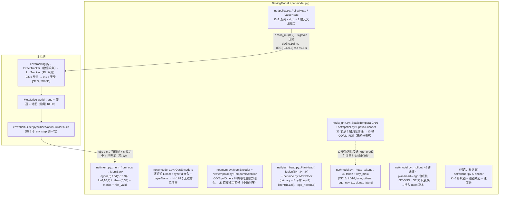
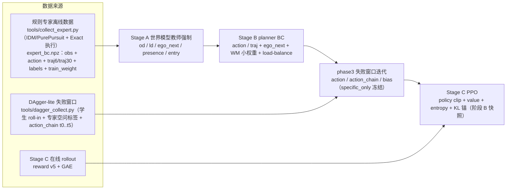

# 网络架构（代码口径）——数据流 / 模块实现 / IO 维度与物理意义 / 监督

> **依据 = 当前代码**（`net/`、`env/obs/`、`pipeline/`、`reward_model/`、`config/*.yaml`），不引用设计文档结论；行号对应当前 HEAD（`fa2b985`）。
> 默认超参取 `config/model.yaml` + `config/train.yaml`；与代码内置默认不同处均注明。
> 时间尺度：环境物理步 0.1 s（10 Hz）；**策略步 0.5 s**（每 5 个物理步一次决策，`decision_repeat=5`）。

---

## 0. 系统总览

- 任务：MetaDrive 中的端到端驾驶。网络每 0.5 s 输出动作 `(ds, dθ)`（弧长 + 航向变化），由跟踪器执行。
- 网络（`net/model.py::DrivingModel`）：**mem-bank 输入 → 时序注意力 → plan head(MoE) → 交叉注意力 policy/value 头**，另有 **ST-GNN 递归 rollout（6 步，0.5 s/步）** 做 OD/LD 未来预测；可选 **K-anchor 计划头**（默认关）。
- 训练（`pipeline/stages.py` + `pipeline/trainer.py`）：A=世界模型教师强制 → B=planner BC（primary→specific 两段）→ phase3=DAgger 失败窗口迭代 → C=PPO RL（KL 锚定阶段 B 快照）。
- 数据来源：规则专家（IDM/PurePursuit）离线数据集 + 学生失败窗口 DAgger 数据 + Stage C 在线 rollout。

### 0.1 文件地图（本图涉及）

| 层 | 文件 | 职责 |
|---|---|---|
| 环境观测 | `env/obs/builder.py`、`env/obs/{ego,od,ld,lane,ttc,nav,signal,others,static,world,memory}.py` | 每策略帧组装 obs（当前帧 + 6 帧历史 + 世界系） |
| 执行 | `env/tracking.py`、`pipeline/trainer.py::expand_policy_action` | `(ds,dθ)` → 10 Hz 参考 → `[steer, throttle]`（Exact / LQR） |
| 网络 | `net/{model,mem,encoders,temporal,plan_head,moe,policy,st_gnn,spatial,anchor}.py` | 策略/价值/世界模型前向 |
| 训练 | `pipeline/stages.py`（A/B/C 阶段）、`pipeline/trainer.py`（BC/PPO/phase3/数据） | 损失、冻结、采样、优化 |
| 奖励 | `reward_model/{terms,aggregation,registry,kpi}.py` | Stage C 奖励 v5 |

---

## 1. 主数据流图（前向）



**训练侧数据流（监督）**



---

## 2. 输入契约（obs → 网络）

来源：`env/obs/builder.py::build`（`builder.py:157`）+ `env/obs/schema.py::schema_manifest`（`schema.py:229`）。全部 float32（除 `od_id*` 为 int64）；批维 B 在前，下列为**单环境形状**。

### 2.1 当前帧通道

| 键 | 形状 | 维度含义（物理单位） | 实现 |
|---|---|---|---|
| `ego` | (1,8) | `[v, a_long, a_lat, yaw_rate, steer, curvature, prev_ds, prev_dθ]`：速度 m/s；纵/横向加速度 m/s²；横摆角速度 rad/s；方向盘 [-1,1]；本车道曲率 1/m；**末 2 维 = 上一策略步动作**（m / rad） | `env/obs/ego.py` |
| `od` | (16,9) | 障碍/他车：`[dx, dy, vx, vy, cosθ, sinθ, L, W, type_id]`。dx/dy m（自车系 x 前/y 左）；vx/vy **相对速度** m/s；L/W m；type_id 枚举。固定槽位 = **track id**（跨帧稳定），盒式 scope 前 150/后 50/左右 25 m | `env/obs/od.py` |
| `od_mask` | (16,) | 1 = 槽位本帧有效（已分配 track）；≠"在盒内" | 同上 |
| `od_id` | (16,) int64 | episode 内稳定 track id；-1 = 空槽 | 同上 |
| `od_presence` | (16,) | 1 = 对象本帧在盒内被观测（特征新鲜）；0 = 出盒未释放（特征陈旧） | 同上 |
| `ld` | (16,7) | 车道点：`[dx, dy, heading_rel, curvature, speed_limit, left_line_type_id, right_line_type_id]`。dx/dy m；heading_rel rad（车道−ego）；curvature 1/m（右转负）；speed_limit m/s 原始值；线型 id 枚举。offset {20,40,60,80} m 远场采样；当前车道占 4 primary 槽 + 其余车道环填充 | `env/obs/ld.py` |
| `ld_mask` | (16,) | 1 = 槽位有效 | 同上 |
| `lane` | (1,17) | **当前车道块**（v5）：`[d_lat, heading_err, lane_width, curvature, speed_limit, near(dx,dy,h), mid(...), far(...), near_valid, mid_valid, far_valid]`。d_lat m（正 = ego 在中心线左侧）；heading_err rad（车道−ego）；near/mid/far = s0+5/15/60 m 中心线点在自车系 (dx,dy)+heading_rel；*_valid 0/1 | `env/obs/lane.py` |
| `ttc` | (1,12) | **per-OD-slot TTC 汇总**（v5）：`[min_ttc_x, min_ttc_path, n_lt3_x, n_lt3_path, resp_index, resp_dx, resp_dy, resp_vx, resp_vy, resp_ttc, resp_is_path, valid]`。TTC s（cap 5 s）；ttc_x = dx/(−vx)；ttc_path = 恒速对象进入自车碰撞圆（半径 2.5 m）的最小正根（捕获横向 cut-in）；责任槽位 = 两口径合并最小者 | `env/obs/ttc.py` |
| `nav` | (1,11) | `[ckpt0_dx, ckpt0_dy, ckpt1_dx, ckpt1_dy, cmd_forward, cmd_left, cmd_right, cmd_res0..2, route_completion]`：前方第 1/2 个路线顶点（自车系，m）+ 命令 one-hot（|Δ航向|<10° 为直行）+ 路线完成度 [0,1]。**兼容保留**（规范上下文在 others 里） | `env/obs/nav.py` |
| `signal` | (1,4) | 绿/黄/红/未知 one-hot；本项目恒 `[0,0,0,1]` | `env/obs/signal.py` |
| `others` | (1,33) | 规范上下文 = `nav(11) + speed_limit(1, **归一化** [0,1] = clamp(m/s,0,30)/30) + signal(4) + static(5) + road_class one-hot(12)`。static = `[present, gap_norm, rel_left, rel_same, rel_right]`：自车走廊前方最近 **BaseBuilding（含收费站岗亭）**；gap = 自车中心→障碍近面（m）；rel one-hot 相对车道。road_class = ego 当前 lane block 几何类别 | `env/obs/others.py`、`env/obs/static.py` |
| `ego_world` | (1,3) | t0 世界系位姿 `(x, y, θ)`：m / m / rad（rollout 逐步重算 nav 的锚点） | `env/obs/world.py` |
| `route_world` | (64,2) | 世界系路线折线顶点 `(x,y)` m（首段起点 + 各段终点；不足 64 点末点重复 + mask=0） | 同上 |
| `route_world_mask` | (64,) | 1 = 真实顶点；0 = 补位（下游必须过滤） | 同上 |

### 2.2 6 帧历史（0.5 s 间隔 = stride 5；index 0 最老，-1 = 当前帧；SE(2) 对齐到当前帧）

| 键 | 形状 | 说明 |
|---|---|---|
| `ego_hist` / `ego_hist_mask` | (6,1,8) / (6,1) | ego 8 维逐帧 |
| `od_hist` / `od_hist_mask` | (6,16,9) / (6,16) | 同槽位跨帧身份一致（不做槽位重排） |
| `od_id_hist` | (6,16) int64 | 各帧 track id（不做 SE(2) 变换；缺帧 -1） |
| `od_presence_hist` | (6,16) | 各帧 presence（缺帧 0） |
| `ld_hist` / `ld_hist_mask` | (6,16,7) / (6,16) | 车道点逐帧 |
| `others_hist` / `others_hist_mask` | (6,1,33) / (6,1) | 上下文逐帧 |
| `hist_valid` | (6,) | 1 = 该历史槽来自真实帧；0 = 预热补位/过滤洞（**训练/注意力按此屏蔽**） |

> 网络入口 `net/mem.py::mem_from_obs`（`mem.py:350`）做形状/类型校验与回退：旧 28 维 others 自动重排到 33（static 段补 0 + 一次性告警）；缺历史键时用当前帧复制（见 `mem.py:27-35`）。单槽通道 `(B,6,1,F)` 自动挤压为 `(B,6,F)`。
> `lane`/`ttc` 是**当前帧上下文**，默认不进 6 帧历史；旧 schema v4 数据缺键 → 全 0 + mask=0（`net/mem.py::context_features_from_obs`，`mem.py:210`）。

### 2.3 动作空间与执行（`net/policy.py:43`、`env/tracking.py`）

- 动作 `(ds, dθ)`：ds = 下一 0.5 s 弧长（m），dθ = 下一 0.5 s 航向变化（rad）。
- 界：`ds ∈ [0,10]`、`dθ ∈ [−0.6, 0.6]`；由 `sigmoid` 压缩 `low + span·σ(raw_mu)` 保证（`policy.py:164`）。
- 运动学：`net/model.py::arc_step`（`model.py:157`，恒曲率圆弧 `dx=R·sin dθ, dy=R·(1−cos dθ)`）+ `compose_pose`（`model.py:172`）；`interpolate_actions`（`model.py:181`）把 6 步动作插值为 30 点 @10 Hz。
- 执行：`env/tracking.py` — **ExactTracker**（数据采集：把 ego 运动学直接置于插值位姿）/ **LqrTracker**（RL/评测：跟踪 10 Hz 参考点，横向 LQR + 纵向比例）。子进程池无 in-worker tracker 时用 `expand_policy_action`（`trainer.py:5393`）的一阶运动学替代。

---

## 3. 模块细节（实现 / 输入输出 / 物理意义）

### 3.1 `net/encoders.py::ObsEncoders`（`encoders.py:110`）

- **实现**：每通道一个 `nn.Linear(F,H)` + 可学习类型嵌入（7 类：ego/od/ld/nav/signal/lane/ttc）+ `LayerNorm`；无效位置（mask=0）输出严格 0（`_embed`，`encoders.py:144`）。OD 另有轨道身份桶嵌入（`id % 64`，`encoders.py:169`）。权重在历史帧/合成帧/当前帧间**共享**。
- **输入→输出（单帧）**：

| 输入 | 维度 | 输出 |
|---|---|---|
| ego | (B,8) | (B,H) |
| od | (B,16,9) + id | (B,16,H) |
| ld | (B,16,7) | (B,16,H) |
| lane | (B,17) | (B,H) |
| ttc | (B,12) | (B,H) |
| others | (B,33) | (B,H) |
| nav | (B,11) | (B,H) |
| signal | (B,4) | (B,H) |

- 图节点位姿提取：`od_pose` = `(dx, dy, atan2(sinθ, cosθ))`（`encoders.py:198`）；`ld_pose` = `(dx, dy, heading_rel)`（`encoders.py:215`）。

### 3.2 `net/mem.py::MemBank` / `mem_from_obs`（`mem.py:265`、`mem.py:350`）

- **实现**：4 个 per-modality 记忆的 dataclass：`ego (B,6,8)`、`od (B,6,16,9)`、`od_id (B,6,16)`、`od_presence (B,6,16)`、`ld (B,6,16,7)`、`others (B,6,33)` + `*_mask` + `*_valid (B,6)`。
- **只读约束**：net 只读；rollout 必须先 `clone()` 4 份副本再 `shift_*`（切片 + `cat`，不原地改写真 mem，`mem.py:294`）。
- **物理意义**：mem 是"每 0.5 s 一帧的 3 秒记忆"，最后一帧 = 当前帧；`*_valid` 标记真实帧（预热补位帧为 0）。

### 3.3 `net/mem.py::MemEncoder` + `net/temporal.py::TemporalAttention`（`mem.py:740`、`temporal.py:41`）

- **实现**：单查询键值注意力池化（key_dim = H/4 = 32），键上加**帧龄嵌入**（age 0 = 最新）；`ok = slot_mask & valid`，全屏蔽列输出 0 且反向有限（softmax 用 −1e4 屏蔽）。
- **IO**：`x (B,T,N,H) → (B,N,H)`。对 ego/others N=1；OD N=16。
- **聚合结果**（`MemEncoder.encode`，`mem.py:750`）：

| 输出 | 形状 | 物理意义 |
|---|---|---|
| `ego_ctx` | (B,128) | 6 帧 ego 动力学/动作历史的注意力聚合 |
| `od_ctx` | (B,16,128) | 每槽 6 帧轨迹聚合（身份一致） |
| `ld_ctx` | (B,16,128) | **当前帧**车道点编码（LD 不做时序） |
| `others_ctx` | (B,128) | 6 帧上下文（nav/限速/信号/static/road_class）聚合 |
| `od_live` | (B,16) | 当前帧 `od_mask & od_presence`（"新鲜且有效"） |
| `ld_live` | (B,16) | 当前帧 ld_mask |
| `frame` (FrameEncoding) | nodes (B,33,128)、node_mask (B,33)、pose (B,33,3)、type_ids (B,33) | 空间图节点 `[ego(1), OD(16), LD(16)]`，ego 恒在原点 |

### 3.4 `net/plan_head.py::PlanHead` + `net/moe.py::MoEBlock`（`plan_head.py:41`、`moe.py:80`）

- **输入**：`ego_ctx (B,128)`、`od_pool (B,128)`（16 槽掩码均值池化，`model.py:275`）、`ld_pool (B,128)`、`others_ctx (B,128)`、`nav_token (B,128)`、`signal_token (B,128)`。
- **融合**：`Linear(768→128)+GELU+Linear(128→128)` → `fused (B,128)`。
- **MoE**：`primary` MLP 128→256→128（常开）；8 个专家同构、**输出层零初始化**（初始严格为 0）；router `Linear(128→64)+GELU+Linear(64→8)` → **top-2 softmax**（恰 2 个非零、和为 1，`moe.py:52`）；`out = primary + residual_scale · Σ_{i∈top2} g_i·expert_i`（`moe.py:169`）。`moe_enabled=false`（阶段 A / B-phase1）时输出严格 = primary。
- **负载均衡 aux**（α>0 时）：`α · E · Σ_i f_i·P_i`，`f_i` = 门控质量占比（detach）、`P_i` = 全专家 softmax 概率 batch 均值（`moe.py:63`）。
- **输出**：
  - `latent (B,128)` = `LayerNorm(fused + moe_out)` —— 策略/价值注意力的**融合 latent token**（experts→policy 条件通路）；
  - `ego_next (B,6)`：**下一帧 ego 特征预测** `[v, a_long, a_lat, yaw_rate, steer, curvature]`（8 维的前 6 维；末 2 维 reserved 由 rollout 写执行动作）；
  - `moe_aux`：`router_logits (B,8)`、`expert_weights (B,8)`、`load_balance_loss`（标量）等。

### 3.5 `net/policy.py::PolicyHead` / `ValueHead`（`policy.py:76`、`policy.py:119`、`policy.py:198`）

- **结构（v6 交叉注意力头）**：K=1 个学习查询（1×128）→ `layers` 层 pre-LN 交叉注意力（4 头、head_dim=32、残差）→ 输出 LayerNorm。**policy/value 各一份，不共享权重**；全无效行输出严格 0（`policy.py:64-73`）。
- **令牌集合（39 个）**（`net/model.py::_head_tokens`，`model.py:600`）：
  `[OD 16, LD 16, lane 1, others 1, ego 1, nav 1, ttc 1, signal 1, 融合 latent 1]`，key_mask = `[od_live, ld_live, lane_mask, 1, 1, nav_mask, ttc_mask, signal_mask, 1]`（ego/latent 恒有效）。
  - t0 头的 OD/LD 令牌用 **t0 单次 st_gnn 消息传递**的对象级特征（`_t0_object_features`，`model.py:582`，no_grad）；rollout 步用当步 `od_ctx/ld_ctx`（不额外跑消息传递）。
- **PolicyHead 输出**：
  - `raw_mu (B,2)` → `squash` → `action_mu (B,2)`（ds∈[0,10] m、dθ∈[−0.6,0.6] rad）；末层零初始化 ⇒ 初始动作 = 界中点 (5 m, 0 rad)；
  - `raw_logstd (B,2)` → clamp [−5,0] → `action_logstd (B,2)`（初始 ≈ −1.0，std≈0.37）；
  - `sample`：重参数化采样 + sigmoid 压缩（PPO collect 用）；`log_prob`：含 sigmoid 雅可比修正（`policy.py:185`）。
- **ValueHead 输出**：`V(s) (B,1)`（`Linear(128→128)+GELU+Linear(128→1)`）。

### 3.6 `net/st_gnn.py::SpatioTemporalGNN` + `net/spatial.py::SpatialEncoder`（`st_gnn.py:34`、`spatial.py:61`）

- **图**：33 节点 `[ego, od_0..15, ld_0..15]`；邻接（`spatial.py:84`）：OD↔ego、LD↔ego（全双向）、LD 槽位相邻（按"当前车道 offset 优先 + 其余车道环"排序）、OD 近邻 4（欧氏距离对称化）。边特征 5 维：`[Δx/100, Δy/100, cosΔθ, sinΔθ, ‖Δp‖/100]`。
- **消息传递**：2 层，`MLP([h_i, h_j, edge])` 按有效边掩码均值聚合 + 节点 MLP + LayerNorm 残差；无效节点每层清零（`spatial.py:32`）。
- **单步推演（t0 帧预测空间）**（`st_gnn.py:146`）：
  - 节点 = `[ego_ctx + step_embed(k), od_ctx, ld_ctx]`（步嵌入区分 horizon）；
  - 先验：OD **匀速外推** `p0 + k·0.5·v`；LD 在 t0 帧**静止**；
  - 输出 = 先验 + 零初始化残差头：`od_pred (B,16,5) = [dx,dy,vx,vy,heading_rel]`（t0 自车系）、`ld_pred (B,16,4) = [dx,dy,heading_rel,curvature]`、`presence_logit (B,16)`（bias +2 先验）、`entry_logit (B,16)`（bias −2 先验）。

### 3.7 递归 rollout（`net/model.py::_rollout`，`model.py:768`）

每步 k=1..6（动作 dt=0.5 s）：

1. **位姿链**：`arc_step(ds,dθ)` + `compose_pose` 累积（**action/pose 链可微**，训练 plan head 的动作链）；
2. **A4 nav 重建**：世界系位姿按动作推进 → 用 `route_world` 重算 nav（checkpoint/命令/route_completion）→ 同步 `others` 的 nav 子向量（纯函数替换，`model.py:304-369`）；无 `route_world/ego_world` 时回退 t0 冻结（旧数据兼容）；
3. **ego 合成帧**：`[ego_next(6 维), 执行动作(2 维)]` → **detach** → 挤入 ego mem 副本（弹最老帧）；
4. **ST-GNN**：以更新后 mem 编码为条件，推演第 k 步 OD/LD 预测（t0 帧）；
5. **SE(2) 反变换**：预测从 t0 帧变换到**当前累积位姿系**，静态属性（L/W/type/线型）沿用 carry → **detach** → 挤入 od/ld mem 副本；
6. **自回归动作**：k<6 时用新 mem 重编码 → plan head → policy 头 → 下一步动作（K-anchor 开启时尾段由锚计划驱动，见 §3.8）。

- **detach 语义（固定）**：真实 obs 帧（step0）不 detach（检测任务梯度直达编码器）；rollout 合成帧在挤入前 detach（状态链切断），但 **action/pose 链保持可微**（`model.py:20-23`）。
- **输出**（堆叠）：`traj_xy (B,6,2)`（t0 自车系，t=0.5..3.0 s 的 6 个动作端点）、`traj_theta (B,6)`、`plan (B,6,2)`（`plan[:,0] == action_mu`）、`od_pred (B,6,16,5)`、`ld_pred (B,6,16,4)`、`od_presence_pred (B,6,16)`、`od_entry_pred (B,6,16)`。

### 3.8 K-anchor 计划头（可选，默认关；`net/anchor.py` + `plan_head.py:155`）

- 开关：`config/model.yaml::plan_anchor.enabled=false` ⇒ `num_anchors=0` ⇒ **无新参数/新输出，模型与旧版逐位一致**（旧 ckpt 严格加载）。
- 开启后新增：**选择头** `latent→K logits`（零初始化 ⇒ 初始均匀）、**连续速度头** `latent→6×ds`（sigmoid ×10，初始 ≈3.5 m/步）、**逐锚残差头** `[latent, anchor_embed(32)]→K×6×2`（零初始化）。
- 锚字典：`config/plan_anchors_k6.json`（K=6 形状锚，由专家数据 cumdθ KMeans 拟合；lane 帧 ds/dθ）；`anchor_mixture`（`anchor.py:294`）：`plan_ds = speed + Σp·res_ds`、`plan_dθ_lane = Σp·(anchor_dθ+res)`，经"沿车道跟随"剖面回投 ego 帧（`lane_follow_dtheta`，`anchor.py:146`；车道无效 → 恒等）。
- 输出（开启时）：`anchor_logits (B,6)`、`anchor_probs (B,6)`、`anchor_plan (B,6,2)`、`anchor_speed (B,6)`、`anchor_residual (B,6,6,2)`、`anchor_ctx (B,3)`。
- 契约：`plan[:,0] == action_mu` 不变（step0 仍由策略头钉住）。

---

## 4. 输出契约（`forward()`，`model.py:899`）

| 键 | 形状 | 物理意义 | 消费方 |
|---|---|---|---|
| `action_mu` | (B,2) | 有界动作均值 `(ds, dθ)`：m / rad（每 0.5 s） | 执行/BC 监督 |
| `action_logstd` | (B,2) | 对角高斯 log 标准差（clamp [−5,0]） | PPO 采样/更新 |
| `value` | (B,1) | V(s) 状态价值 | PPO/GAE |
| `router_logits` | (B,8) | MoE 路由 logits | 负载诊断 |
| `expert_weights` | (B,8) | top-2 混合权重（2 个非零、和为 1） | 负载诊断 |
| `latent` | (B,128) | plan head 融合 latent（experts→策略条件通路） | 注意力头/诊断 |
| `ego_next` | (B,6) | 下一帧 ego 特征预测（前 6 维） | Stage A/B 监督 |
| `load_balance_loss` | 标量 | Switch 式负载均衡 aux（α 已乘） | 训练损失 |
| `traj_xy` | (B,6,2) | 6 个动作端点位姿（t0 自车系；t=0.5..3.0 s） | BC traj 监督/可视化 |
| `traj_theta` | (B,6) | 各端点航向 rad | 诊断 |
| `plan` | (B,6,2) | rollout 实际执行的 6 个动作（`[:,0]==action_mu`） | phase3 动作链监督/跟踪参考 |
| `od_pred` | (B,6,16,5) | 6 步 OD 预测 `[dx,dy,vx,vy,heading]`（t0 自车系） | Stage A/B WM 监督 |
| `ld_pred` | (B,6,16,4) | 6 步 LD 预测 `[dx,dy,heading,curvature]` | Stage A/B WM 监督 |
| `od_presence_pred` | (B,6,16) | 未来帧同 track id 是否仍在盒内（logits） | BCE 监督 |
| `od_entry_pred` | (B,6,16) | 未来帧是否出现新 id（logits） | BCE 监督 |
| （K-anchor 开启）`anchor_*` | 见 §3.8 | 锚选择/速度/残差/混合计划 | 锚监督/诊断 |

**廉价路径**：`forward(obs, rollout=False, world_model=False)`（PPO collect/update 用）省略 traj/WM 多步键，但 `action_mu/action_logstd/value` 与完整前向**逐位一致**（`model.py:82-83`、`tests/test_net_shapes.py::test_cheap_path_matches_full_forward`）。

---

## 5. 监督（训练信号，代码口径）

### 5.1 阶段 / 可训范围 / 损失一览

| 阶段 | 入口 | 可训参数（代码） | 数据 | 损失（默认权重，`config/train.yaml`） |
|---|---|---|---|---|
| **A** 世界模型 | `stages.py::run_stage_a` | **除 `policy.`/`value.` 外全部**（encoders/mem_encoder/plan_head/st_gnn；`stages.py:1782-1791`）；**MoE 关闭**（`stages.py:1733`） | 专家数据集 + 未来查表 | `od 1.0` + `ld 0.0` + `ego_next 0.1` + `presence 0.1` + `entry 0.1` |
| **B** BC | `stages.py::run_stage_b` | **phase1（primary，前 50% epoch）**：冻结 `st_gnn./value./plan_head.moe.experts./plan_head.moe.router.`（`stages.py:2654`），MoE 关；**phase2（specific）**：只训 `experts/router/residual_scale`，冻结主干+primary+policy+WM（`stages.py:2674`） | 专家数据集 | `action 1.0` + `traj_aux 0.1` + `ego_next 0.1` + `od 0.005` + `ld 0.002` + `presence 0.1` + `entry 0.1` + `load_balance 0.01` |
| **phase3** DAgger 迭代 | `pipeline/phase3_loop.py` → `trainer.py::pretrain_bc_phase3` | 默认 `freeze=specific_only`：只训 `experts/router/residual_scale`（`_SPECIFIC_PHASE_FREEZE`）；WM/ego_next/锚项在冻结下自动置 0（`trainer.py:4446`） | 学生失败窗口 + 专家空问标签 | `action 1.0` + `action_chain 0.2` + `bias_calib 0.0` + `ego_next 0.1` + `od 0.005` + `ld 0.002` + `presence 0.1` + `entry 0.1` + `load_balance 0.01` + `anchor_ce/wta 0.0` |
| **C** PPO RL | `stages.py::run_stage_c` → `trainer.py::PPOTrainer` | `trainable_scope=design`（默认）：**allowlist = `policy. / value. / plan_head.moe.experts. / plan_head.moe.residual_scale`**，其余全冻（含 router，`trainer.py:913`） | 在线 rollout（reward v5） | `policy clip 0.2` + `0.5·value MSE` − `0.01·entropy` + `KL 锚 0.05→0`（阶段 B 快照） |

### 5.2 数据来源（代码）

- **专家离线数据**（`tools/collect_expert.py`）：规则专家 `env/expert/pure_pursuit_idm.PurePursuitIDMPolicy` + ExactTracker；每策略帧存 obs、专家动作 `(ds,dθ)`（由 `[steer, throttle]` 反解）、`traj6`（6 端点，t=0.5..3.0 s）与 `traj30`（0.1 s 密集）、场景标签、`train_weight`。
- **未来目标**（Stage A/B 的 WM 监督）：按 `(episode, step+5k)` 查表 + SE(2) 对齐到 t0 + mask/valid（`stages.py` / `pipeline/frames.py`）；OD 槽位按 t0 帧最近邻匹配（8 m 门限）。
- **DAgger 失败窗口**（`tools/dagger_collect.py`）：学生策略 roll-in（LQR 执行，与评测同协议）→ 只保留失败 episode（collision/out_of_road/terminal）终止前 N 秒窗口 → 对**学生当前状态**调用专家 `act()` 得"空问"标签；`action[k]` = 策略帧 `t+0.5k s` 的专家标签链（末端缺失置 NaN，训练按有限性 mask）。
- **Stage C 在线数据**：`collect_rollout`（`trainer.py:6319`）每 0.5 s 前向（cheap path）→ 采样动作 → 环境步进（跟踪参考默认 = `repeat(a_t)` 6 步）→ reward v5 → 存 buffer（obs/pose/action/logprob/value/reward/terminated/spec_id）。

### 5.3 Stage A：世界模型教师强制（`stages.py::_wm_predictions`，`stages.py:1931`）

- **机制**：每步把**目标帧真实 ego**（`ego_fut`，无则用 `ego_next_features` 解析构造）挤入 mem 副本（reserved 2 维写专家 GT 动作，可加噪声）；合成帧一律 detach；每步调 `st_gnn(step_index=k)` 得 t0 帧预测（直接多步，无递归误差累积）；**每步挤入 GT 帧之前**跑 plan head 得 `ego_next_pred`（否则 plan head/MoE 在 A 阶段无梯度）。
- **损失**（`_forward_terms`，`stages.py:2128`；`total = od + ld_coef·ld + ego_next_coef·ego_next + presence_coef·presence + entry_coef·entry`）：

| 项 | 公式（代码） | 目标 | 权重 |
|---|---|---|---|
| OD 多步 | `smooth_l1(β=1)([dx,dy,vx,vy])/4 + (1−cosΔheading)`，权重 = `od_mask·wm_valid·frame_weight`，分子/分母同口径（`trainer.py:2028`） | `future["od_fut"]` → 5 维预测空间 | 1.0 |
| LD 多步 | 同构：`smooth_l1` 于 `[0,1,3]`（位置+曲率）+ `1−cos` 于 heading（`trainer.py:2089`） | `ld_fut[..., :4]` | `ld_coef=0.0`（仅监控） |
| ego_next | `smooth_l1(β=1)` 于 ego 前 6 维，权重 `frame_weight·wm_valid`（`stages.py:2184`） | `ego_fut[..., :6]`（下一帧真实 ego 特征） | 0.1 |
| presence | BCE-with-logits，**id 轴**：t0 槽位 j 的 track id 在目标帧 k 仍被观测 → 1（`stages.py:1528`） | `od_presence_fut`（同 id） | 0.1 |
| entry | BCE-with-logits：目标帧出现"t0 未观测"的新 id → 1 | `od_id_fut/od_id_t0` | 0.1 |

### 5.4 Stage B：planner BC（`trainer.py::pretrain_bc`，`trainer.py:3393`）

- **动作监督**（首步）：`action_mu` vs 专家即时动作 `targets["action"][:,0,:]`；L2（默认）**逐维权重 `[1.0, 69.4]`**（`(10/1.2)²`，令 ds/dθ 相对误差等权），逐样本 `(per_dim·w).sum()/2`；权重 = `train_weight × balance`（phase2：worst-50% 行 1.0 / 其余 0.1，全量曝光）（`trainer.py:3842-3847`）。
- **轨迹辅助**：`traj_xy` vs `traj6` 加权 MSE/MAE，权重 0.1（DAgger 行按 `traj_aux_valid` 屏蔽）。
- **WM 小权重**：od 0.005 / ld 0.002 / presence 0.1 / entry 0.1 / ego_next 0.1（同一教师强制机制）。
- **MoE 负载**：phase2 开 MoE + α=0.01 aux。
- **router 无监督标签**（去聚类）：8 个场景标签只作数据契约/切片分析，不参与 router 损失。

### 5.5 phase3：失败窗口迭代（`trainer.py::_phase3_loss_terms`，`trainer.py:4475`）

- 前向 `model(obs, rollout=True)` → `plan`；`action_mu` vs 专家首步动作（权重 1.0）；`plan[:,1:]` vs 教师链 `action_chain`（权重 0.2，按 `chain_valid` mask，`trainer.py:2157`）；`bias_calib`（默认 0，逐维 signed-bias 惩罚，`trainer.py:2370`）；WM 项在 `specific_only` 下自动置 0；可选锚 CE/WTA（默认 0）。
- 冻结：`specific_only`（只训 experts/router/residual_scale）；另有 `trunk_only` 安全配方（只训主干）与 `all`（全解冻，历史失败配方）。

### 5.6 Stage C：PPO + 奖励 v5（`trainer.py::PPOTrainer.update`，`trainer.py:6557`）

- **PPO**：`ratio = exp(new_logprob − old_logprob)`；`policy_loss = −min(ratio·A, clip(ratio,1±0.2)·A)`；`value_loss = MSE(V, returns)`；`entropy = 高斯熵`；`loss = policy_loss + 0.5·value_loss − 0.01·entropy`；梯度裁剪 0.5；lr 3e-4；epochs 4；minibatch 1024（config）；GAE γ=0.99、λ=0.95；优势归一化 global（padding/bootstrap 行不进优势链）；可选 `target_kl` 早停（默认 null）。
- **KL 锚**：对阶段 B 快照（ref model，no_grad）的 raw-mu/logstd 高斯 KL × `kl_anchor_coef`（0.05 → 线性衰减到 0）；锚探针只读记录梯度范数（`trainer.py:6686-6700`）。
- **奖励 v5**（`reward_model/aggregation.py`，每 0.5 s 结算一次）：

```
reward = dense_positive_sum × carl_multiplier + dense_negative_sum
       + terminating_sum + carl_penalty + terminal_value
```

  - 稠密项（`reward_model/terms.py::DEFAULT_TERM_CONFIGS`，`terms.py:819`）：`route_completion 1.0`（γ=1.0 势能塑形）、`speed_ratio 0.4`（cap 1.0）、`low_speed −0.2`（v<2 m/s 时 `−0.2·(1−v/2)`）、`comfort_lon −0.05`（死区 2.5 m/s²）、`comfort_lat −0.05`（2.0）、`comfort_jerk −0.005`（5.0）、`solid_line −2.0`、`speed_limit −5.0`（容差 5%）、`crash −10.0`、`out_of_road −8.0`。
  - CaRL：违规帧只把**正向**稠密和乘 factor（负向保留）；终局值（rc=1 基准档）：arrive **+30**、collision **−19**、out_of_road **−15**、max_step **−23**、error **−5**。
  - 可选臂（默认关）：`ttc −0.5`（threshold 2.0 s / floor 0.5 s）、`lane_boundary −0.2`（margin 0.5 m）、`lane_center −0.1`（deadband 0.25 m）。

### 5.7 模块 ← 损失 梯度来源汇总

| 模块 | Stage A | Stage B | phase3 | Stage C |
|---|---|---|---|---|
| `encoders.` / `mem_encoder.` | ✔ WM 项 | ✔（phase1；phase2 冻结） | 仅安全配方（trunk_only） | ✘ 冻结（design） |
| `plan_head.fusion/norm/ego_next/primary` | ✔ WM + ego_next | ✔（phase1；phase2 冻结） | 仅安全配方 | ✘ 冻结（design） |
| `plan_head.moe.experts` / `residual_scale` | ✘（MoE 关） | ✔（phase2） | ✔（specific_only） | ✔（design allowlist） |
| `plan_head.moe.router` | ✘ | ✔（phase2，经负载 aux + 下游） | ✔（specific_only） | ✘（移出 allowlist，仅观测） |
| `st_gnn.` | ✔ WM 项 | ✘ 冻结 | ✘ 冻结（安全配方亦然） | ✘ 冻结 |
| `policy.` | ✘ 冻结 | ✔（phase1）/ ✘ 冻结（phase2，`_SPECIFIC_PHASE_FREEZE`） | ✘ 冻结（梯度穿过但不更新） | ✔ |
| `value.` | ✘ 冻结 | ✘ 冻结 | ✘ 冻结 | ✔ |
| K-anchor 头（4 前缀） | —（默认关） | 仅 `anchor_ce/wta>0` 时 | `specific_only` 下随主干冻结且损失置 0 | ✘ |
| `lane`/`ttc` token 编码 | ✔（经下游损失） | ✔ | ✔ | ✘（编码器冻结） |

---

## 6. 当前默认开关与版本状态（代码）

| 项 | 值 | 落点 |
|---|---|---|
| 主干隐藏维 H | **128** | `config/model.yaml::hidden_dim` → `pipeline/stages.py::build_model` |
| 专家隐藏维 | **256**（8 专家 / top-2） | `config/model.yaml::moe` |
| 历史帧 / 策略步 | 6 帧 @ 0.5 s（stride 5）；dt=0.5 s | `net/encoders.py:53`、`config/model.yaml` |
| OD/LD 槽位 | 16 / 16；TTC cap 5 s、horizon 3 s、碰撞半径 2.5 m | `net/encoders.py`、`env/obs/ttc.py` |
| 令牌集合 | T = 39（OD16+LD16+lane+others+ego+nav+ttc+signal+latent） | `net/model.py:600` |
| 注意力头 | 4 头 × 1 层 × K=1 查询 | `net/policy.py:50`、`config/model.yaml` 无覆盖（代码默认） |
| K-anchor | **默认关**（`enabled=false` ⇒ `num_anchors=0` ⇒ 与旧版逐位一致） | `config/model.yaml::plan_anchor` |
| obs schema | **v5**（lane/ttc 默认通道；v4 旧数据缺键回退 0+mask=0） | `env/obs/schema.py:239`、`net/mem.py:210` |
| MoE 运行态 | 推理默认开；A 关；B-phase1 关 / phase2 开；C 冻结 router | `net/moe.py:108`、`stages.py:1733`、`trainer.py:3645` |
| 动作界 | ds∈[0,10] m、dθ∈[−0.6,0.6] rad / 0.5 s；logstd clamp [−5,0] | `net/policy.py:43-46` |
| Stage C 冻结 | `trainable_scope=design`（policy/value + experts + residual_scale） | `trainer.py:913` |
| 奖励 | v5（rc=1 基准档终局值 +30/−19/−15/−23/−5） | `reward_model/aggregation.py::default_terminal_values` |

---

*本文件为代码推导的架构说明（2026-10-07）；维度/公式/权重均可回溯到上表所列文件行号。*
